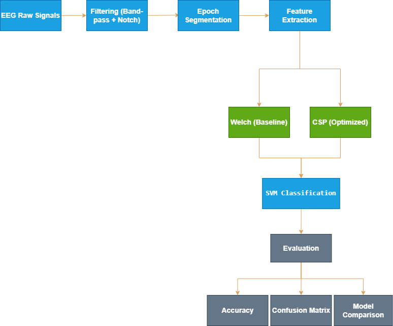
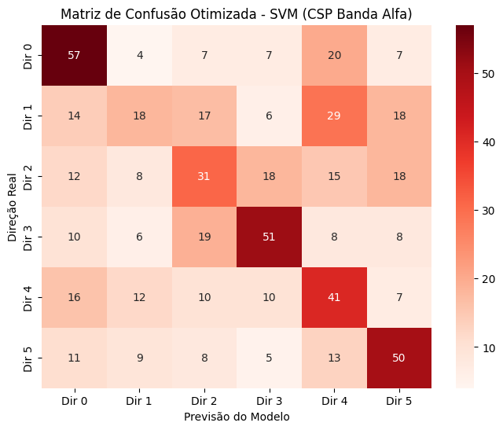
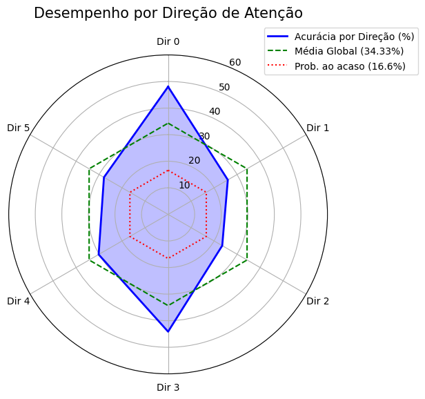

# 🧠 EEG-based Brain-Computer Interface (BCI) — SSVEP Classification

## 📌 Overview
This project implements a Brain-Computer Interface (BCI) system using EEG signals to decode visual attention based on the SSVEP (Steady-State Visually Evoked Potentials) paradigm.

The objective is to classify the direction of attention from multichannel EEG data using signal processing and machine learning techniques.

---

## 📊 Dataset
- Source: PhysioNet — Covert Shifts of Attention
- Multichannel EEG recordings
- Multiple classes representing attention directions

---

## ⚙️ Methodology

### 1. Preprocessing
- Band-pass filtering
- Notch filtering (powerline noise removal)
- Epoch segmentation

---

### 2. Feature Extraction

Two approaches were evaluated:

#### Baseline
- Welch spectral estimation

#### Optimized
- Common Spatial Patterns (CSP)
- Spatial filtering to enhance class separability

---

### 3. Classification
- Model: Support Vector Machine (SVM)
- Multi-class classification

---

### 4. Additional Analysis
- Independent Component Analysis (ICA) for artifact handling
- Comparison between:
  - Arbitrary component removal
  - Data-driven validation approach

---

## 🔁 Processing Pipeline

  

---

## 📈 Results

### Confusion Matrix — Optimized Model

  

---

### Accuracy per Direction — Optimized Model

  

---

## 📊 Baseline vs Optimized Comparison

| Method | Feature Extraction | Classifier | Accuracy |
|--------|-------------------|------------|----------|
| Baseline | Welch spectral estimation | SVM | 20.50% |
| Optimized | CSP spatial filtering | SVM | 41.33% |

The optimized pipeline improved performance by **+20.83 percentage points** compared to the Welch-based baseline.

---

## 🧠 Key Insights

- CSP significantly improves class separability compared to spectral-only methods
- Welch-based approach performs close to chance level (~16.66% for 6 classes)
- Spatial filtering is critical for extracting meaningful EEG patterns
- Arbitrary ICA component removal can degrade performance
- Data-driven preprocessing decisions improve robustness

---

## 🛠️ Technologies
- Python
- NumPy
- SciPy
- MNE-Python
- Scikit-learn
